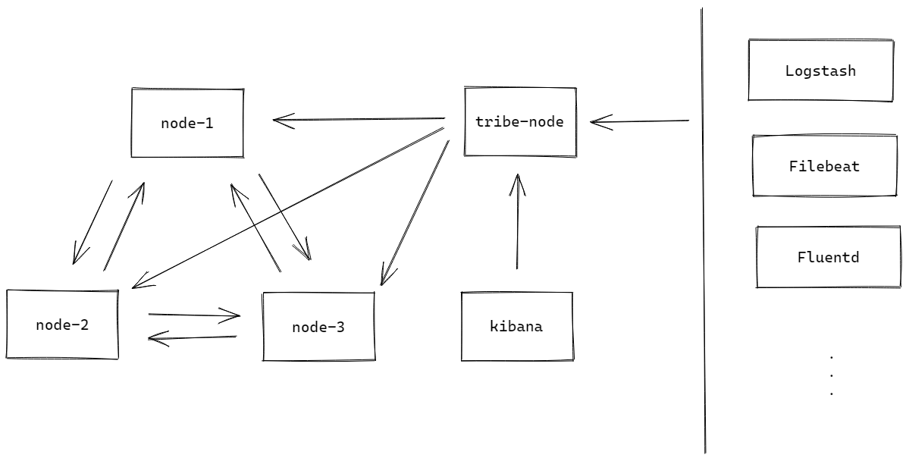

# 「部署篇」Elastic Ansible 使用

Ansible 部署 Elastic 集群

## 架构



## 变量

`group_vars/all.yaml`：

```yaml
# 01.chrony
chrony_intranet_server: '10.10.115.10'

# 03.elasticsearch
network_interface: 'ens192'
```

其他均使用角色默认变量，有注释。

